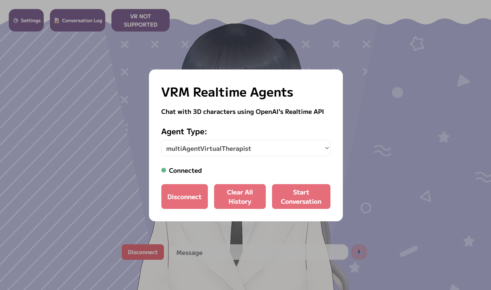

# VRM Realtime Agents

A real-time multi-agent virtual therapist system using OpenAI Realtime API, OpenAI Agent SDK with VRM avatars and WebXR support.

Try the app yourself: [https://vrm-realtime-agents.vercel.app](https://vrm-realtime-agents.vercel.app)

## Agent System
- **Greeting Agent** – onboarding, consent, and therapy mode selection  
- **CBT Therapist Agent** – structured, skills-based cognitive behavioral therapy  
- **Humanistic Therapist Agent** – person-centered, empathic conversation  
- **Safety Agent** – crisis monitoring and escalation  

## Handoff Mechanism
- Greeting Agent hands off to CBT or Humanistic Agent based on user preference  
- Any agent can hand off to the Safety Agent if crisis signals are detected  
- Shared memory and context ensure smooth transitions without losing conversation flow  




## Installation & Setup

### 1. Install Dependencies
```bash
npm install
```

### 2. Setup API Key
Set up your OpenAI API key as a system environment variable:

**Windows:**
```cmd
setx OPENAI_API_KEY "your_openai_api_key_here"
```

**macOS/Linux:**
```bash
export OPENAI_API_KEY="your_openai_api_key_here"
```

Add to your shell profile (`.bashrc`, `.zshrc`, etc.) to make it permanent:
```bash
echo 'export OPENAI_API_KEY="your_openai_api_key_here"' >> ~/.bashrc
```

### 3. Run the Project
```bash
npm run dev
```

Open your browser:
- **VRM Chat Interface**: http://localhost:3000
- **Debug Interface**: http://localhost:3000/debug

## Replace VRM Avatar

### 1. Add Your VRM File
Place your `.vrm` file in the `public/vrm/` directory.

### 2. Configure VRM Mapping
Edit `src/app/lib/vrmManager.ts`:

```typescript
private vrmConfigs: Record<string, VRMConfig> = {
  multiAgentVirtualTherapist: {
    vrmUrl: "/vrm/your-avatar.vrm",  // Change this path
    idleAnimationUrl: "/animations/idle_loop.vrma"
  }
};
```

## Configure New Multi-Agent System

### 1. Create Agent Configuration Directory
```
src/app/agentConfigs/yourNewSystem/
├── index.ts
├── agent1.ts
├── agent2.ts
└── tools/
    └── yourTools.ts
```

### 2. Define Individual Agents
Create agent files (e.g., `agent1.ts`):

```typescript
import { RealtimeAgent } from "@openai/agents/realtime";

export const agent1 = new RealtimeAgent({
  name: "agent1",
  voice: "alloy",
  handoffDescription: "Description of when to handoff to this agent",
  instructions: `Your agent instructions here...`,
  tools: [
    // Your tools here
  ],
  handoffs: [] // Will be populated in index.ts
});
```

### 3. Configure System & Handoffs
Create `index.ts`:

```typescript
import { agent1 } from './agent1';
import { agent2 } from './agent2';

// Configure handoffs between agents
(agent1.handoffs as any).push(agent2);
(agent2.handoffs as any).push(agent1);

// Export the multi-agent scenario
export const yourNewSystemScenario = [agent1, agent2];
export const yourNewSystemCompanyName = 'Your Company Name';
```

### 4. Register the System
Edit `src/app/agentConfigs/index.ts`:

```typescript
import { yourNewSystemScenario } from './yourNewSystem';

export const allAgentSets: Record<string, RealtimeAgent[]> = {
  multiAgentVirtualTherapist: multiAgentVirtualTherapistScenario,
  yourNewSystem: yourNewSystemScenario, // Add your system here
};

// Optional: Change default
export const defaultAgentSetKey = 'yourNewSystem';
```

### 5. Add VRM Configuration (Optional)
If using custom avatar, edit `src/app/lib/vrmManager.ts`:

```typescript
private vrmConfigs: Record<string, VRMConfig> = {
  multiAgentVirtualTherapist: { /* existing config */ },
  yourNewSystem: {
    vrmUrl: "/vrm/your-system-avatar.vrm",
    idleAnimationUrl: "/animations/idle_loop.vrma"
  }
};
```

Your new multi-agent system will now appear in both the VRM chat interface and debug interface dropdown menus.

## Data Storage

**Memory & History Context**: All conversation history and memory context is stored locally in your browser's localStorage. This means:
- Your data never leaves your device
- Conversations persist between browser sessions
- Clearing browser data will remove all stored conversations
- Data is isolated per browser and device

## Disclaimer of Liability

This software is provided for educational and research purposes only. The virtual therapist agents are AI-powered chatbots and are not a substitute for professional medical advice, diagnosis, or treatment. 

**Important Notes:**
- This system is not intended to provide actual therapeutic or medical services
- Always seek the advice of qualified healthcare professionals for any medical or mental health concerns
- The developers and contributors of this project are not responsible for any decisions made based on interactions with the AI agents
- Use this software at your own risk and discretion
- The AI responses may not always be accurate, appropriate, or suitable for your specific situation

By using this software, you acknowledge that you understand these limitations and agree to use it responsibly.

## Built Upon

This project is built upon and extends the following open-source projects:

- **[ChatVRM](https://github.com/pixiv/ChatVRM)** by Pixiv - Provides the VRM avatar rendering and animation system
- **[OpenAI Realtime Agents](https://github.com/openai/openai-realtime-agents)** by OpenAI - Provides the multi-agent framework and realtime conversation capabilities

This project gratefully acknowledges these projects and their contributors for making this work possible.

## License

This project is licensed under the MIT License - see the [LICENSE](LICENSE) file for details.
